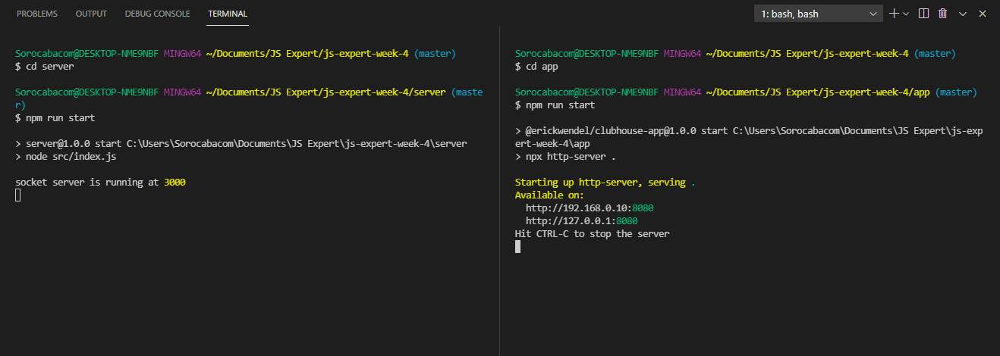

# ClubHouse Clone Template - Semana JS Expert 4.0

Este repositório contém os arquivos desenvolvidos durante a semana JS Expert 4, do professor [ErickWendel](https://erickwendel.teachable.com/) 

O projeto é um clone do App ClubHouse, uma aplicação para conversas de áudio entre usuarios. Foram utilizados os conceitos de #websocket , #peerjs e #webRTC.
 
Seguem as orientações para executar a aplicação localmente:

## Requisitos de ambiente

-Node 14^

-Npm

## Como executar:

Clone este repositório, navegue para a pasta do projeto e execute em dois terminais de linha de comando:

No terminal 1:

- cd server (entrar na pasta do servidor local)

- npm install (instalar as dependências)

- npm run start  

No terminal 2: (com o server em execução através do terminal 1), execute:

- cd app (entrar na pasta do app front)

- npm install (instalar as dependências)

- npm run start   

## Orientações

Você deve acessar primeiro a página de login e fazer a autenticação através do Github, e com isso, você será 

redirecionado para a página de lobbys (listagem de todas as salas existentes de conversas).

Você pode acessar uma existente ou criar uma nova.

Ao entrar em alguma sala, você pode duplicar a sua guia e simular o acesso de outro usuário.

## Preview

### Página de Login

### Página de Salas

### Página de Sala

## Checklist Features

- [x] O app deve funcionar na Web, Android e IOS
- Login
  - [x] Deve ter login com GitHub
    - [x] Se houver dados do usuario em localStorage deve ir para lobby direto

- Lobby
  - [x] Se não houver dados do usuario em localStorage deve voltar para login
  - [x] Mostra todas as salas ativas
  - [x] Atualiza salas em realtime
  - [x] Pode criar uma sala sem topico
  - [x] Pode criar uma sala com topico
  - [x] Pode acessar salas ativas
- Room
  - [x] Se não houver dados do usuario em localStorage deve voltar para login
  - [x] Cria uma sala com um usuário dono
  - [x] Todos usuários futuros entram com perfil de attendees
  - [x] Notifica Lobby sobre atualizações na sala
  - [x] Lista usuarios com perfis de speakers e attendees
  - [x] Se o dono da sala desconectar, será removida
  - Users
    - Speaker
      - [x] Recebe notificação de attendees para se tornarem speakers
      - [x] Atualizam a tela o upgrade de attendee para speaker
      - [x] Poderá deixar seu microfone mudo
      - Se dono da sala
        - [x] Pode aprovar attendees a virarem speakers
        - Ao se desconectar
          - [x] Promove o speaker mais velho da sala
          - [x] Se não houver speaker promove o attendee mais velho da sala
    - Attendee
      - [x] Pode ouvir speakers ativos
      - [x] Pode pedir upgrade de perfil ao dono da sala
        - Ao ser aprovado
          - [x] Reinicia todas as suas chamadas ativas com os usuarios da sala
          - [x] Recebe as permissões do perfil speaker
